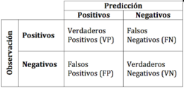

```{r setup, echo=FALSE, cache=FALSE}
library(knitr)
library(rmdformats)

## Global options
options(max.print="75")
opts_chunk$set(echo=TRUE,
	             cache=TRUE,
               prompt=FALSE,
               tidy=TRUE,
               comment=NA,
               message=FALSE,
               warning=FALSE)
opts_knit$set(width=75)
```

<ul>
<li><a href="https://www.linkedin.com/in/marlon-gaviria-p%C3%A9rez-4ab558169/" title="Visitar Pagina profesional de Marlon Gaviria"><font color = 'white'>  Marlon Gaviria Perez    1020483480 </font></a></li> 


<li><a href="https://www.linkedin.com/in/jessica-quintero-l%C3%B3pez-44b61019a/" title = "Visitar Pagina profesional de Jessica Quintero"><font color = 'white'> Jessica Quintero Lopez 1152714624 </font></a></li>
</ul>

# <font color = 'darkcyan'>**Punto I**</font></color>{.tabset}
**1.** (10 pts. Teorico) Considere el estadistico leverage: 

$h_{i i}=\frac{1}{n}+\frac{\left(x_{i}-\bar{x}\right)^{2}}{\sum_{i^{\prime}=1}^{n}\left(x_{i^{\prime}}-\bar{x}\right)^{2}}$

Demuestre que:

$\frac{1}{n} \leq h_{i i} \leq 1$

***Prueba:*** 

* Notemos que $h_{i i}$ se minimiza cuando $\frac{\left(x_{i}-\bar{x}\right)^{2}}{\sum_{i^{\prime}=1}^{n}\left(x_{i^{\prime}}-\bar{x}\right)^{2}}$ sea un minimo, que esto a su vez es minimo cuando ${({x}_{i}-\overline{x})}^2$ lo sea, en otras palabras; Donde ${({x}_{i}-\overline{x})}^2$ se minimice, tambien se minimiza $h_{i i}$.
${({x}_{i}-\overline{x})}^2$ es una parabola, y esta se minimiza en ${x}_{i}=\overline{x}$, en el cual se hace cero; Y asi tendriamos que:
$\frac{\left(x_{i}-\bar{x}\right)^{2}}{\sum_{i^{\prime}=1}^{n}\left(x_{i^{\prime}}-\bar{x}\right)^{2}}=0$ y por consiguiente $h_{i i}=\frac{1}{n}+0$, con lo cual el menor valor que puede tomar ${h}_{ii}$ es $\frac{1}{n}$

* Ahora debemos notar que la matriz HAT $H$ es idempotente, es decir ${H}^2=X{({X}^TX)}^{-1}{X}^{T}X{({X}^TX)}^{-1}{X}^{T}=X{({X}^TX)}^{-1}{X}^{T}=H$ y ademas $H$ es simetrica, en otras palabras cada valor en su posicion opuesta a la diagonal es igual, $({h}_{ij}={h}_{ji})$ y esto igualandolo a la posicion de la diagonal $ii$ en $H$ respecto a ${H}^2$ tendremos que $h_{ii}\ge h_{ii}^2$, ahora basta con dividir por $h_{ii}$ en esta desigualdad y obtenemos que
$h_{ii}\ge h_{ii}^2  \Longrightarrow h_{ii} \le 1.$

* Finalmente hemos concluido que los valores $h_{ii}$ cumplen que $\frac1n \le h_{ii} \le 1.$


# <font color = 'darkcyan'>**Punto II**</font></color>{.tabset}
**2.** (50 pts. practico) Considere el conjunto de datos anexo (*bank.csv*) el cual tiene 17 variables. Asuma que el supervisor es la variable loan.

## *a* 
**a)** Cree un conjunto de datos de entrenamiento del 75% y el restante 25% tratelo como datos de test o de prueba.

La base de datos bank sera particionada en dos subconuntos de datos donde el 75% serán utilizados para el entrenamiento del modelo y el 25% restantes seran utilizados para la prueba del ajuste del modelo, lo primero que se realiza es fijar un semilla, esto con el fin de que los datos sean reproducibles, se utiliza la función *sample* de R para garantizar que la eleccion de los datos para entrenamiento y prueba sea de manera aleatoria, en esta funcion se especifica la cantidad total de observaciones que contiene la base *bank* y le especificamos ademas el tamaño de muestra que queremos seleccionar para el conjunto de entrenamiento que en este caso serian el 75% del total de las observaciones en la base inicial y a su vez los datos restantes perteneceran al conjunto de prueba, finalmente obtenemos unos datos para test (prueba) y otros para train (entrenamientos). 


```{r II split DB}
bank <- read.csv('TareaII/bank.csv')

## librerias
library(e1071)
library(dummies)
library(class)
library(MASS)
library(caret)
library(pROC)

# PUNTO 2 LITERAL A -------------------------------------------------------
set.seed(1152714624)
bank$loan <- as.factor(bank$loan)
n <- nrow(bank)*0.75
aleatorio <- sample(1:nrow(bank),n)
train <- bank[aleatorio,]
test <- bank[-aleatorio,]
```


## *b*
**b)** Con los datos de entrenamiento, implemente Naive Bayes usando *loan* como el supervisor y las demas como predictores

En R podemos encontrar diversos paquetes para la implementación de Naive Bayes, en este caso utilizaremos el paquete **e1071{}** que contiene la funcion *naiveBayes* y permite el ajuste de un modelo por dicho metodo, para un adecuado uso de esta funcion debemos especificar: variable respuesta, covariables o variables supervisoras y el nombre del conjunto de datos que contiene nuestros datos, en este caso la variable respuesta sera loan: has personal loan? , es una variable binaria es decir tomar el valor de “yes” y “no” y las demas variables seran las covariable con las que se quiere explicar o predecir esta variable respuesta. 

```{r II NB}
# PUNTO 2 LITERAL B -------------------------------------------------------

model_nb <-naiveBayes(loan~., data=train)

```


## *c*
**c)** Con los datos de entrenamiento, implemente Knn usando *loan* como el supervisor y las demas como predictores. Ensaye con varios valores de K y reporte solo uno de acuerdo a su preferencia. Observe que algunas variables son categoricas y se deben crear variables dummies.

Teniendo un conocimiento previo de lo que representa cada variable se puede observar que algunas de ellas son categóricas por lo cual es adecuado convertirlas en variables dummy, en R la librería **dummies{}** nos permite llevar a cabo este proceso de una manera óptima y sencilla por medio de la función *dummy* a la cual se le especifica la variable que queremos modificar.


```{r II Knn}
# PUNTO 2 LITERAL C -------------------------------------------------------

## dummies en la data de train
job <- dummy(train$job ,sep="_")
marital <- dummy(train$marital, sep="_")
education <- dummy(train$education, sep="_")
default <- dummy(train$default, sep="_")
housing <- dummy(train$housing, sep="_")
loan <- ifelse(train$loan=='yes',1,0)
contact <- dummy(train$contact, sep="_")
month <- dummy(train$month, sep="_")
poutcome <- dummy(train$poutcome, sep="_")
deposit <- dummy(train$deposit, sep="_")
age <- train$age
day <- train$day
duration <- train$duration
campaign <- train$campaign 
pdays <- train$pdays
balance <- train$balance
previous <- train$previous

train <- data.frame(age,job,marital,education,default,balance,housing,
                    loan,contact,day, month, duration, campaign,
                    pdays, previous, poutcome,deposit)
train$loan <- as.factor(train$loan)

## dummies en la data de test 
job_t <- dummy(test$job ,sep="_")
marital_t <- dummy(test$marital, sep="_")
education_t <- dummy(test$education, sep="_")
default_t <- dummy(test$default, sep="_")
housing_t <- dummy(test$housing, sep="_")
loan_t <- ifelse(test$loan=='yes',1,0)
contact_t <- dummy(test$contact, sep="_")
month_t <- dummy(test$month, sep="_")
poutcome_t <- dummy(test$poutcome, sep="_")
deposit_t <- dummy(test$deposit, sep="_")
age_t <- test$age
day_t <- test$day
duration_t <- test$duration
campaign_t <- test$campaign 
pdays_t <- test$pdays
balance_t <- test$balance
previous_t <- test$previous

test <- data.frame(age_t,job_t,marital_t,education_t,default_t, balance_t,housing_t,
                     loan_t,contact_t,day_t, month_t, duration_t, campaign_t,
                     pdays_t,previous_t, poutcome_t,deposit_t)
names(test) <- names(train)
test$loan <- as.factor(test$loan)
```

De la base de datos de entrenamiento encontramos que las variables job, marital, education, default, housing, loan, contact, month, poutcome y deposit son categóricas y por lo tanto se convierten en variables dummy aplicando el proceso anteriormente explicado, luego de tener este arreglo en nuestra base de datos de entrenamiento lo que queremos es implementar KNN usando loan como el supervisor y las demás como predictores, la función en R recibe los siguientes parámetros: train que es el conjunto de datos de entrenamiento, test que representa el conjunto de datos de prueba, cl que es la variable respuesta y finalmente el valor de los K vecinos a utilizar para el ajuste, en este caso para determinar el valor de K se probó con diferentes valores, 2,3,4,5,6,7,8,10,15,20,50,90,150,350 y se obtuvo que un valor óptimo para K es decir que redujera el error de clasificación es 50, teniendo en cuenta esto entonces realizamos un ajuste final del modelo. 
```{r}

## Implementando KNN con diferentes valores de k -------------------------


k <- c(2,3,4,5,6,7,8,10,15,20,50,90,150,350)
results <- list()
for (i in k) {
    knn <- knn(train = train[,-26], test=test[,-26], cl = train$loan, k=i)
    t<-table(knn,test$loan)
    test_error<-(t[1,2]+t[2,1])/(sum(t))
    results[i] <- c(test_error)
}
resultsf <- unlist(results, use.names=FALSE)
resultsf

plot(k,resultsf, type='l', col='blue', lwd=2, ylab='Tasa de error de Clasificaci?n')
points(50,min(resultsf), col='red', pch=19)
abline(v=50, lty=2, col='red')
text(75,0.18, "K=50", col='red')
grid()

## se puede observar que con K=30 el modelo ajustado
## obtene una menor tasa de error de clasificacion
## por lo que este ser?a el numero optimo de vecinos.


knn <- knn(train = train[,-26], test=test[,-26], cl = train$loan, k=50)
```


## *d*
**d)** Con los datos de entrenamiento, implemente Regresion logistica usando *loan* como el supervisor y las demas como predictores.

 La regresion logistica es un tipo de analisis utilizado para predecir el resultado de una variable categorica en funcion de las variables independientes o predictoras. Es util para modelar la probabilidad de un evento como funcion de otros factores, este tipo de modelos se pueden implementar en R por medio de la funcion *glm*: Generalized Linear Models donde se especifica la variable respuesta y las covariables o variables regresoras, ademas un parametro que puede ser importante es el parametro *family* que es una una descripcion de la distribucion de errores y la funcion de enlace que se utilizara en el modelo, en este caso la variable respuesta es loan y las demas son las covariables y en family se especifica que es binomial. 
```{r II reg-logit, comment= '#'}
# PUNTO 2 LITERAL D REGRESION LOGISTICA -----------------------------------------------------
model_logi <- glm(loan~., data=train, family='binomial')
summar <- summary(model_logi)
summar$aic
```

```{r names correction, echo = F}

rownames(summar$coefficients) <- c('Intercept', "train_age", "job_admin", "job_blue_collar",
				   "job_entrepreneur","job_housemaid","job_management","job_retired",
 "job_self_employed","job_services","job_student","job_technician","job_unemployed","marital_divorced","marital_married",
 "education_primary","education_secondary","education_tertiary" ,"default_no","train.balance",
"housing_no","contact_cellular","contact_telephone","train.day", "month_apr","month_aug", 
"month_dec","month_feb","month_jan","month_jul","month_jun","month_mar","month_may",
"month_nov","month_oct","train.duration","train.campaign","train.pdays","train.previous",
"poutcome_failure","poutcome_other","poutcome_success","deposit_no" )

summar$coefficients %>% kable() %>% 
	kable_styling(bootstrap_options = c('striper','hover'))


```


## *e*
**e)** Con los datos de entrenamiento, implemente LDA usando *loan* como el supervisor y las demas como predictores.

El proposito del LDA es encontrar la combinacion lineal de las variables originales que permita la mejor separacion entre grupos de un set de datos, este tipo de modelos se pueden implementar en R por medio de la funcion lda donde se especifica la variable respuesta y las covariables o variables regresoras de la misma manera que cuando se implementa un modelo de regresion lineal en este caso la variable respuesta es loan y las demas son las covariables.
```{r}
l_da <- lda(loan ~ ., data = train)
```
* Prior probabilities of groups:

```{r, echo = F}
l_da$prior
```


```{r, echo = F}
nams <- c("age","job_admin","job_blue.collar","job_entrepreneur","job_housemaid", "job_management","job_retired","job_self.employed","job_services","job_student",
  "job_technician","job_unemployed","job_unknown","marital_divorced",
  "marital_married","marital_single","education_primary","education_secondary",
  "education_tertiary","education_unknown","default_no","default_yes","balance",
  "housing_no","housing_yes","contact_cellular","contact_telephone",
  "contact_unknown","day","month_apr","month_aug","month_dec","month_feb","
  month_jan","month_jul","month_jun","month_mar","month_may","month_nov",
  "month_oct","month_sep","duration","campaign","pdays","previous",
  "poutcome_failure","poutcome_other","poutcome_success", "poutcome_unknown",
  "deposit_no","deposit_yes")


rownames(l_da$scaling) <- nams

l_da$scaling %>% kable() %>%
	kable_styling(bootstrap_options = c('striper','hover'))

```


## *f*
**f)** con los datos de entrenamiento, para cada uno de los metodos anteriores, calcule el training-MSE, la matriz de confusion y grafique la curva ROC.

Queremos observar y comparar el desempeño de diferentes metodos utilizados para clasificacion en este caso: KNN, Naive Bayes, Regresion logistica y, para esto se utilizan las funciones anteriormente mencionadas que nos ofrece el lenguaje de programacion R, para llevar a cabo este proceso en todos se utilizara la variable loan como la variable respuesta y las demas como covariables teniendo en cuenta solo el conjunto de datos de entrenamiento. 

Para realizar las respectivas comparaciones lo que implementaremos será el cálculo del training-MSE y la matriz de confusión que es una herramienta que permite la visualización del desempeño de un algoritmo que se emplea en aprendizaje supervisado, para recordar el cálculo del trainin-MSE es: 

$\text {Training}-M S E=\frac{1}{n} \sum_{i=1}^{n}\left(y_{i}-\widehat{f\left(x_{i}\right)}\right)^{2}$

Y para obtener la matriz de confusión usaremos la librería caret que ofrece la función confusionMatrix donde se especifican los datos reales y las predicciones y se obtiene una estructura como la siguiente:


```{r}

# PUNTO 2 LITERAL F TRAINING-MSE ------------------------------------------------------------

## KNN 
pred_knn <- knn(train = train[,-26], test=train[,-26], cl = train$loan, k=50)
matriz_knn<-confusionMatrix(pred_knn, train$loan)$table
matriz_knn


MSE_knn <- (1/nrow(train))*sum((abs(as.numeric(pred_knn)-1)-as.numeric(train$loan))^2)
MSE_knn

## con NAIVE BAYES
pred_nb <- predict(model_nb, train[,-26], type='class')
loan <- ifelse(train$loan==1,"yes","no")
matriz_nb<-confusionMatrix(pred_nb, as.factor(loan))$table
matriz_nb

loan2 <- ifelse(train$loan=="yes",1,0)
pred_nb2 <- ifelse(pred_nb=="yes",1,0) 

MSE_nb <- (1/nrow(train))*sum((as.numeric(loan2)-as.numeric(pred_nb2))^2)
MSE_nb


## con GLM
pred_logi <- model_logi$fitted.values
pred_logif <- exp(pred_logi)/(1+exp(pred_logi))
classif <- ifelse(pred_logi>=0.5,1,0)
matriz_logi<-confusionMatrix(as.factor(classif), train$loan)$table
matriz_logi
MSE_log <- (1/nrow(train))*sum((as.numeric(classif)-as.numeric(train$loan))^2)
MSE_log


## con LDA 
pred_lda <- predict(l_da)
pred_lda <- pred_lda$class
matriz_lda<-confusionMatrix(pred_lda,train$loan)$table
matriz_lda
MSE_lda <- (1/nrow(train))*sum((abs(as.numeric(pred_lda)-1)-as.numeric(train$loan))^2)
MSE_lda

print(list("MSE KNN"=MSE_knn,"MSE NB"=MSE_nb, "MSE RLOGI"=MSE_log, "MSE LDA"=MSE_lda))


(roc(response=train$loan,predictor= abs(as.numeric(pred_knn)-1),
     plot=TRUE, legacy.axes=F, col='tomato'))
(roc(response=train$loan,predictor= as.numeric(pred_nb2),
     plot=TRUE, legacy.axes=F, col='green'))
(roc(response=train$loan,predictor=as.numeric(pred_logi),
     plot=TRUE, legacy.axes=F, col='darkcyan'))
(roc(response=train$loan,predictor=abs(as.numeric(pred_lda)-1),
     plot=TRUE, legacy.axes=F, col='darkred'))


```

Luego de realizar los pasos anteriores se obtuvo que de los 4 metodos implementados se puede observar que para KNN ,LDA y Regresion logistica se obtienen resultados muy similares debido a que el Training-MSE de los tres  es aproximadamente el mismo 1.398519 ,1.386334 y 1.394218 respectivamente, siendo estos los de menor desempeño porque su error fue superior en comparación al de Naive Bayes que por el contrario obtuvo un Training- MSE de 0.03524074 siendo este el menor. 
Sin embargo y teniendo en cuenta el grafico del ROC y el respectivo AUC encontramos que para los modelos de KNN, Naive Bayes y LDA el area bajo la curva (AUC) es muy cercano a 0.5 indicando que los modelos de clasificacion correspondiente basicamente no tiene utilidad, ya que su capacidad predictiva no es mejor que adivinar al azar, por otro lado el modelo planteado con Regresión logistica si presenta un AUC de 0.7248 indicando que clasifica bien mas del 50% de las veces. 

## *g*
**g)** Use los respectivos ajustes de cada uno de los modelos anteriores y con el conjunto de prueba, calcule el test-MSE, la matriz de confucion y grafique la curva ROC.

En este caso se procede de la misma manera que en el literal F la diferencia sera que no se tendran en cuenta los datos de entrenamiento si no los datos de prueba o test,en este caso no se encuentra mucha diferencia con los resultados obtenidos para el conjunto de entrenamiento, se puede observar que que para KNN,LDA y Regresión logistica   nuevamente se ven calculos muy similares debido a que el Test-MSE de los tres es aproximadamente el mismo 1.372985, 1.356861 y 1.370477 respectivamente, siendo estos lo de menor desempeño porque su error fue superior al de Naive Bayes que por el  contrario obtuvo un Test- MSE de 0.040487 siendo este el de menor error. 

Sin embargo y teniendo en cuenta el grafico del ROC y el respectivo AUC encontramos que para los modelos de KNN, Naive Bayes y LDA el area bajo la curva (AUC) es muy cercano a 0.5 indicando que los modelos de clasificacion correspondiente basicamente no tiene utilidad, ya que su capacidad predictiva no es mejor que adivinar al azar, por otro lado el modelo planteado con Regresion logistica si presenta un AUC de 0.7179 indicando que clasifica bien mas del 50% de las veces.
```{r}
# PUNTO 2 LITERAL G TEST-MSE ------------------------------------------------------------

## KNN

pred_knnt <- knn(train = train[,-26], test=test[,-26], cl = train$loan, k=50)
matriz_knnt <-confusionMatrix(pred_knnt, test$loan)$table
matriz_knnt


MSE_knnt <- (1/nrow(test))*sum((abs(as.numeric(pred_knnt)-1)-as.numeric(test$loan))^2)
MSE_knnt


## con NAIVE BAYES
pred_nbt <- predict(model_nb, test[,-26], type='class')
loan <- ifelse(test$loan==1,"yes","no")
matriz_nbt<-confusionMatrix(pred_nbt, as.factor(loan))$table
matriz_nbt

loan2 <- ifelse(test$loan=="yes",1,0)
pred_nb2 <- ifelse(pred_nbt=="yes",1,0) 

MSE_nbt <- (1/nrow(test))*sum((as.numeric(loan2)-as.numeric(pred_nb2))^2)
MSE_nbt


## con GLM
pred_logit <- predict(model_logi, test[,-26], type='response')
pred_logift <- exp(pred_logit)/(1+exp(pred_logit))
classift <- ifelse(pred_logit>=0.5,1,0)
matriz_logit<-confusionMatrix(as.factor(classift), test$loan)$table
matriz_logit
MSE_logt <- (1/nrow(test))*sum((as.numeric(classift)-as.numeric(test$loan))^2)
MSE_logt


## con LDA 
pred_ldat <- predict(l_da, test[,-26])
pred_ldat <- pred_ldat$class
matriz_ldat<-confusionMatrix(pred_ldat,test$loan)$table
matriz_ldat
MSE_ldat <- (1/nrow(test))*sum((abs(as.numeric(pred_ldat)-1)-as.numeric(test$loan))^2)
MSE_ldat


print(list("MSE knn"=MSE_knnt,"MSE NB"=MSE_nbt, "MSE LOGI"=MSE_logt, "MSE LDA"=MSE_ldat))


(roc(response=test$loan,predictor= abs(as.numeric(pred_knnt)-1),
     plot=TRUE, legacy.axes=F, col='tomato'))
(roc(response=test$loan,predictor= as.numeric(pred_nb2),
     plot=TRUE, legacy.axes=F, col='green'))
(roc(response=test$loan,predictor=as.numeric(pred_logit),
     plot=TRUE, legacy.axes=F, col='darkcyan'))
(roc(response=test$loan,predictor=abs(as.numeric(pred_ldat)-1),
     plot=TRUE, legacy.axes=F, col='darkred'))

```


## *h*
**h)** Con cual modelo observo un mejor desempeño y porque?

Para determinar cuál modelo tuvo un mejor desempeño se analizaron el Training-MSE, Test-MSE, curvas ROC, la matrices de confusión, dando mayor importancia al cálculos del MSE, tanto para los datos de entrenamiento como para los de test, se observó que para ambos conjuntos de datos los resultados no tuvieron diferencias muy significativas por lo que se puede determinar que el modelo que dio mejores resultados fue Naive Bayes dado que este dio menos tasa de error de clasificación y menor Training y Test-MSE.

# <font color = 'darkcyan'>**Punto III**</font></color>{.tabset}
**3.** (40 pts. Practico) Considere el conjunto de datos anexo (*costumer_loan_details.csv*) el cual tiene 12 variables incluyendo el ID. Asuma que el supervisor es la variable income.

## *a*
**a)** Cree un conjunto de datos de entrenamiento del 75% y el restante 25% tratelo como datos de test o de prueba.

\

Acontinuacion creamos la base de datos de entrenamiento *training* y la de prueba como *testing* tal y como se ve en el siguiente codigo
```{r read BD}
## datos

costumer <- read.csv('TareaII/costumer_loan_details.csv')

## librer?as
library(e1071)
library(dummies)
library(class)
library(kableExtra)

# PUNTO 3 LITERAL A -------------------------------------------------------
set.seed(1020483480)
n <- nrow(costumer)*0.75
aleatorio <- sample(1:nrow(costumer),n)
training <- costumer[aleatorio,]
testing <- costumer[-aleatorio,]

```

Veamos brevemente estas bases

```{r}
head(training) %>% kable() %>% 
	kable_styling(bootstrap_options = c("striped", "hover"), font_size = 7)
dim(training)  # dimension de la base de datos de entrenamiento "Training"
head(testing) %>% kable() %>% 
	kable_styling(bootstrap_options = c("striped", "hover"),font_size = 7)
dim(testing)   # # dimension de la base de datos de prueba "Testing"
```

## *b*
**b)** Con los datos de entrenamiento, implemente Knn (con al menos tres valores para K) usando income como el supervisor y debts como predictor. Grafique e interprete.

Para el calculo de Knn invocamos la funcion Knn.reg() albergada en la libraria *FNN{}*, y usamos una regilla para los valores de k=3,6,20,45 y 80.

note que los puntos negros indican el valor observado, los rojos son el valor ajustado por Knn y se trazan lineas azules punteadas indicando las distancias entre el punto y su valor observado; Como sigue:
```{r punto 3 knn}
# PUNTO 3 LITERAL B -------------------------------------------------------
library(FNN)
# K=3

mod_knn3 <- knn.reg(train=training$debts,test = as.matrix(training$debts),
		    y = training$income,k = 3)


plot(training$debts,training$income, pch = 16, cex = 1.36,
     xlab='Debts', ylab = 'Income', main = 'Modelo Knn \n K=3');grid()
legend('bottomright',c('Valores reales','Valores ajustados'), col = c('black','red'),lty = 1,
       bty = 'n')
points(training$debts,as.numeric(as.character(mod_knn3$pred)), 
       col = 'red', pch = 16)
segments(training$debts,training$income,training$debts,as.numeric(as.character(mod_knn3$pred)),
         lty = 2, col = "blue")

```


```{r}

# K=6
mod_knn6 <- knn.reg(train=training$debts,test = as.matrix(training$debts),
	       y = training$income,k = 6)


plot(training$debts,training$income, pch = 16, cex = 1.36,
     xlab='Debts', ylab = 'Income', main = 'Modelo Knn \n K=6');grid()
legend('bottomright',c('Valores reales','Valores ajustados'), col = c('black','red'),lty = 1,
       bty = 'n')
points(training$debts,as.numeric(as.character(mod_knn6$pred)),
       col = 'red', pch = 16)
segments(training$debts,training$income,training$debts,as.numeric(as.character(mod_knn6$pred)),
	 lty = 2, col = "blue")
```


```{r}
# K=20

mod_knn20 <- knn.reg(train=training$debts,test = as.matrix(training$debts),
	       y = training$income,k = 20)


plot(training$debts,training$income, pch = 16, cex = 1.36,
     xlab='Debts', ylab = 'Income', main = 'Modelo Knn \n K=20');grid()
legend('bottomright',c('Valores reales','Valores ajustados'), col = c('black','red'),lty = 1,
       bty = 'n')
points(training$debts,as.numeric(as.character(mod_knn20$pred)), col = 'red', pch = 16)
segments(training$debts,training$income,training$debts,as.numeric(as.character(mod_knn20$pred)),
	 lty = 2, col = "blue")
```

```{r}
# K=45

mod_knn45 <- knn.reg(train=training$debts,test = as.matrix(training$debts),
	       y = training$income,k = 45)


plot(training$debts,training$income, pch = 16, cex = 1.36,
     xlab='Debts', ylab = 'Income', main = 'Modelo Knn \n K=45');grid()
legend('bottomright',c('Valores reales','Valores ajustados'), col = c('black','red'),lty = 1,
       bty = 'n')
points(training$debts,as.numeric(as.character(mod_knn45$pred)), col = 'red', pch = 16)
segments(training$debts,training$income,training$debts,as.numeric(as.character(mod_knn45$pred)),
	 lty = 2, col = "blue")

```

```{r}
# K=80

mod_knn80 <- knn.reg(train=training$debts,test = as.matrix(training$debts),
	       y = training$income,k = 80)


plot(training$debts,training$income, pch = 16, cex = 1.36,
     xlab='Debts', ylab = 'Income', main = 'Modelo Knn \n K=80');grid()
legend('bottomright',c('Valores reales','Valores ajustados'), col = c('black','red'),lty = 1,
       bty = 'n')
points(training$debts,as.numeric(as.character(mod_knn80$pred)), col = 'red', pch = 16)
segments(training$debts,training$income,training$debts,as.numeric(as.character(mod_knn80$pred)),
	 lty = 2, col = "blue")
```

Con los graficos anteriores logramos notar que a valores mayores de k los errores (lineas azules) son mas pronunciadas, dando a entender que hay mayor error en modelos que asumen un k mayor, con esta observacion veamos una medida de error para que sean modelos comparables, en este caso usaremos el promedio de las distancias, asi:

```{r}
# errores promedio
knn3 <- mean(abs(as.numeric(as.character(mod_knn3))-training$income))
knn6 <- mean(abs(as.numeric(as.character(mod_knn6))-training$income))
knn20 <- mean(abs(as.numeric(as.character(mod_knn20))-training$income))
knn45 <- mean(abs(as.numeric(as.character(mod_knn45))-training$income))
knn80 <- mean(abs(as.numeric(as.character(mod_knn80))-training$income))

data.frame('K=3'=knn3,'K=6'=knn6,'K=20' = knn20,'K=45'=knn45,'K=80'=knn80) %>% kable() %>% kable_styling(bootstrap_options = c("striped", "hover"))
```

Con esto determinamos que para esta muestra el valor K optimo para el algoritmo de Knn es el valor de 6, pues es el que minimiza las distancias de los puntos ajustados a los valores observados.

## *c*
**c)** Con los datos de entrenamiento, implemente regresion lineal simple usando income como el supervisor y debts como predictor. Grafique e interprete.

Para implementar el modelo de regresion lineal invocaremos la funcion lm() albergada en el paquete *stats{}*
```{r lm}
mod_lm <- lm(income~debts, data=training)
```

```{r plot lm}
plot(training$debts,training$income, pch = 16, xlab='Debts', ylab = 'Income',
     main = 'Modelo \n Regresion Lineal');grid()
points(4000,10000,col = rgb(0,149/255,135/255,0.3), cex = 5000, pch =16)
abline(mod_lm, col = 'red')
```
Notemos que Income tiene un comportamiento lineal en el rango observado, y el modelo se ajusta a la nuve de puntos, siguiere ser un modelo que se acopla y explica los datos observados.

Veamos un resumen de el modelo
```{r}
summary(mod_lm)

mean(abs(mod_lm$fitted.values-training$income))
```
Este modelo logra explicar aproximadamente el 67% de la variabilidad de los datos y su distancia promedio de los datos observados a la linea es de 1747.203 *(units of income)*; Ademas reporta un *valor-p* sumamente bajo respecto al ANOVA, luego el modelo es significativo.

## *d*
**d)** Use los respectivos ajustes de cada uno de los modelos anteriores y con el conjunto de prueba, calcule el test-MSE. Que observa?

Nos proponemos entonces calcular $\text {Test}-M S E=\frac{1}{29} \sum_{j=1}^{29}\left(y_{0 j}-\widehat{f}\left(x_{0 j}\right)\right)^{2}$ de nuestra base de datos de prueba (**testing**) tal como sigue:

```{r test}
# PUNTO 3 LITERAL D -------------------------------------------------------

# Knn K=3
test_knn3 <- knn.reg(train=training$debts,test = as.matrix(testing$debts),
                y = training$income,k = 3)
# Knn K=6
test_knn6 <- knn.reg(train=training$debts,test = as.matrix(testing$debts),
                y = training$income,k = 6)
# Knn K=20
test_knn20 <- knn.reg(train=training$debts,test = as.matrix(testing$debts),
                 y = training$income,k = 20)
# Knn K=45
test_knn45 <- knn.reg(train=training$debts,test = as.matrix(testing$debts),
                 y = training$income,k = 45)
# Knn K=80
test_knn80 <- knn.reg(train=training$debts,test = as.matrix(testing$debts),
                 y = training$income,k = 80)
# Modelo Lineal
mod_lm <- lm(income~debts, data=training)
test_lm <- predict(object = mod_lm,newdata = testing['debts'])
```

Ahora, calculemos los test-MSE asociados a cada modelo.
```{r mse}

# Tests-MSE's -------------------------------------------------------------
k.3 <- mean((as.numeric(as.character(test_knn3$pred))-testing$income)^2)
k.6 <- mean((as.numeric(as.character(test_knn6$pred))-testing$income)^2)
k.20 <- mean((as.numeric(as.character(test_knn20$pred))-testing$income)^2)
k.45 <- mean((as.numeric(as.character(test_knn45$pred))-testing$income)^2)
k.80 <- mean((as.numeric(as.character(test_knn80$pred))-testing$income)^2)
lmt <- mean((test_lm-testing$income)^2)

data.frame('k=3'=k.3,'k=6'=k.6,'k=20'=k.20,'k=45'=k.45,'k=80'=k.80,'lm'=lmt,row.names = 'Test-MSE') %>% kable() %>% 
  kable_styling(bootstrap_options = c("striped", "hover"))
```
La tabla anterior refelja el test-MSE asociado a los modelos Knn para varios K y la de el modelo lineal ajustado con la variable *Debt*, es notorio como la regresion lineal disminuye esta medida mas de lo que el knn pudo en ninguno de sus vertientes de K's a excepcion de k = 20, el cual es ligeramente inferior que el modelo *lm*.

```{r, echo = F}
barplot(c(3803034/1000000,4940131/1000000,5569785/1000000,3598498/1000000,
	  5162453/1000000,9903122/1000000),
	names.arg = c('Lm','k=3','k=6','k=20','k=45','k=80'), 
	col = 'darkred', main = 'Test-MSE', xlab = 'Modelos',
	ylab = 'T-MSE (millones)')
```


## *e*
**e)** Usando todos los datos y regresion lineal multiple seleccione un modelo usando forward, backward y setpwise.

Esta metodologia puede usarse con diferentes funciones, en todas ellas se llega al mismo resultado, solo se reportaran los resultados de la libreria *olsrr{ }*, es la que usaremos para realizar la seleccion de variables con los metodos forward, backward y stepwise para luego contrastarlos.
```{r selection of variables, error=TRUE}
# PUNTO 3 LITERAL E -------------------------------------------------------

library(tidyverse)
library(olsrr)
library(caret)
library(leaps)
library(MASS)
library(rsq)

mod_backward <- step(lm(income~.,data=costumer[,-1]),
                     direction = 'backward',trace = F)
mod_forward <- step(lm(income~.,data=costumer[,-1]),
                    direction = 'forward', trace = F)
mod_stepwise <- step(lm(income~.,data=costumer[,-1]),
                     direction = 'both', trace = F)

mod_backward_AIC <- stepAIC(lm(income~.,data=costumer[,-1]),
                            direction = 'backward',trace = F)
mod_forward_AIC <- stepAIC(lm(income~.,data=costumer[,-1]),
                           direction = 'forward', trace = F)
mod_stepwise_AIC <-stepAIC(lm(income~.,data=costumer[,-1]),
                           direction = 'both', trace = F)

mod_backward_ols <- ols_step_backward_aic(lm(income~.,data=costumer[,-1]))
mod_forward_ols <- ols_step_forward_aic(lm(income~.,data=costumer[,-1]))
mod_stepwise_ols <- ols_step_both_aic(lm(income~.,data=costumer[,-1])) 

```
Debemos tener cuidado pues lo que nos indican las salidas de estos modelos pueden significar las variables que se quedan (forward, stepwise) o las variables eliminadas en la seleccion (backward), esto puede confundir a la hora de observar los resultados, en este orden de ideas observemos.
```{r summary models, echo = F}
mod_forward_ols
mod_backward_ols
mod_stepwise_ols
```


## *f*
**f)** Seleccione uno de los modelos del paso anterior y responda con argumentacion la pregunta. Ajusta  bien dicho modelo?

En la pregunta anterior seleccionaremos el modelo que contiene las variables *age,occupation,debts,marital_status* pues son las variables que se escogieron en 2 metoodologias (forward y stepwise), ademas que es un modelo ajustado que logra explicar alrededor del 95% de la variabilidad de los datos y posee un *valor-p* muy significativo, veamos.
```{r}
mod_select <- mod_forward_ols$model

summary(mod_select)
```
Notemos que es un modelo que logra ajustar muy bien los datos $R^2=95\%,R^2_{adj}=95\%, valor-p<2.2X10^{-16}$  indica que es un modelo que logra ajustarse bien a los datos de entrenamiento.

Como nuestra intencion es predecir, lo mas sensato es ver el desempeño de estos modelos en la base de datos de prueba, note que como stepwise y forward concluyeron con las mismas variables solo es necesario tener en cuenta una de ellas y ser contrastada con backward, como sigue:
```{r}
pred_select <- predict(mod_select,testing)

pred_backward <- predict(mod_backward_ols$model, testing)
```
con estas predicciones podremos calcular una medida de prueba (Test-MSE & Distancia media) para modelo de regresion lineal multiple con seleccion de variables.

* Modelo forward y stepwise (both) 
```{r}
# Modelo forward y stepwise (both) 
mean((pred_select-testing$income)^2)   # test-MSE
mean(abs(pred_select-testing$income))  # distancia media
```

*  Modelo backward
```{r}
# Modelo backward
mean((pred_backward-testing$income)^2)   # test-MSE
mean(abs(pred_backward-testing$income))   # distancia media 

```

Ambos modelos tienen medidas de prueba similares siendo el modelo backward ligeramente mejor, aunque puede que en el ambito practico esta cantidad sea despresiable y se proponga en cambio el modelo *mod_select* pues dos metodologias apuntan a este mismo modelo.


